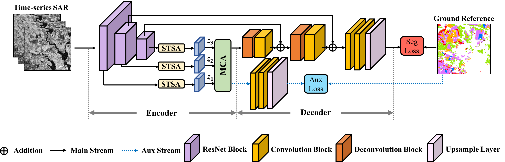

# Spatio-temporal multi-level attention crop mapping method using time-series SAR imagery
[Zhu Han](https://scholar.google.com/citations?user=AtmD3QUAAAAJ&hl=zh-CN&oi=sra), [Ce Zhang](https://scholar.google.com/citations?user=1BGDL6kAAAAJ&hl=zh-CN&oi=sra), [Lianru Gao](https://scholar.google.com/citations?user=La-8gLMAAAAJ&hl=zh-CN&oi=sra), [Zhiqiang Zeng](https://scholar.google.com/citations?user=rKfw-PkAAAAJ&hl=zh-CN), [Bing Zhang](https://scholar.google.com/citations?user=nHup8tQAAAAJ&hl=zh-CN), [Peter M. Atkinson](https://scholar.google.com/citations?user=SK8kZ9cAAAAJ&hl=zh-CN)

___________
This is a PyTorch implementation of the ["Spatio-temporal multi-level attention crop mapping method using time-series SAR imagery"](https://www.sciencedirect.com/science/article/pii/S0924271623003210) in ISPRS Journal of Photogrammetry and Remote Sensing. More specifically, it is detailed as follow.

Usage
---------------------
### Dataset
The adopted Brandenburg Sentinel-1 time-series dataset can be downloaded in [Baiduyun Link](https://pan.baidu.com/s/1g0e9toTicVlyuhdSWF2wXg?pwd=6fqa) or [Google Drive Link](https://drive.google.com/drive/folders/177uZK8VwIcCiBspsfs4GoXxUavP4uA2p?usp=drive_link).

The specific class information of this dataset is listed as follows:

    0：Background
    1: Maize
    2: Wheat
    3: Grassland
    4: Peanut
    5: Potato
    6：Residue
    7: Fallow
    8: Rapeseed
    9: Vegetable
    10: Legume
    11: Herb
    12: Orchard
    13: Flower
    14: Sugar beet
    15：Other

Citation
---------------------

**Please kindly cite the papers if this code is useful and helpful for your research.**

Zhu Han, Ce Zhang, Lianru Gao, Zhiqiang Zeng, Bing Zhang, Peter M. Atkinson. Spatio-temporal multi-level attention crop mapping method using time-series SAR imagery, ISPRS Journal of Photogrammetry and Remote Sensing, vol. 206, pp. 293-310, 2023, doi: 10.1016/j.isprsjprs.2023.11.01.

    @article{HAN2023293,
      title = {Spatio-temporal multi-level attention crop mapping method using time-series SAR imagery},
      author = {Zhu Han and Ce Zhang and Lianru Gao and Zhiqiang Zeng and Bing Zhang and Peter M. Atkinson},
      journal = {ISPRS Journal of Photogrammetry and Remote Sensing},
      volume = {206},
      pages = {293-310},
      year = {2023},
      issn = {0924-2716},
      doi = {https://doi.org/10.1016/j.isprsjprs.2023.11.016},
      url = {https://www.sciencedirect.com/science/article/pii/S0924271623003210},
    }
  
Contact Information
---------------------
Zhu Han: hanzhu19@mails.ucas.ac.cn
